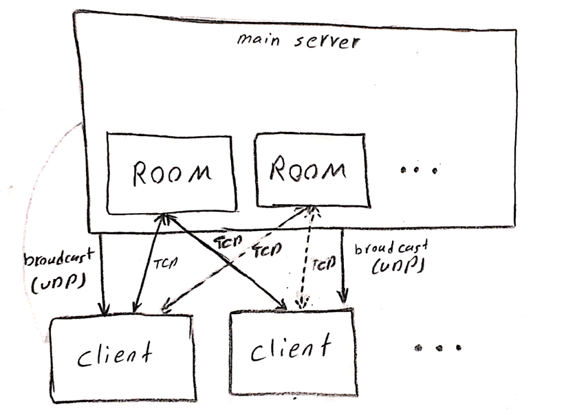

# Networked Rock-Paper-Scissors Game

## Overview
A C++ implementation of Rock-Paper-Scissors using both TCP (for initial handshake) and UDP (for game play). The main server manages multiple “rooms” (subservers), each hosting up to two players. Players join a room, make their choice within 10 seconds, and receive the result immediately.

## Design Diagram
Below is the high-level architecture of the server–subserver–client interaction:



## Key Features

- **Multi-Room Support:** Main server creates N subservers (rooms); each room handles exactly two players.
  
- **Hybrid TCP/UDP:**
  
  - **TCP:** Initial connection, username validation, and room assignment.
    
  - **UDP:** Exchanging choices and broadcasting results to both players.
    
- **Timeout Handling:** If a player doesn’t respond within 10 seconds, the other wins by default.
  
- **Graceful Disconnection:** Detects if a player disconnects and declares the remaining player as winner.

## Prerequisites

- Linux (e.g., Ubuntu).
  
- C++11 (or newer) compiler (e.g., `g++` ≥ 4.8).
  
- Standard socket headers (`<sys/socket.h>`, `<netinet/in.h>`, etc.).
  
- `make` for building.

## Build Instructions

1. **Clone the repo**  
   ```bash
   git clone https://github.com/<your-username>/networked-rps.git
   cd networked-rps

2. **Compile**

   ```bash
   make all
   ```

   * Produces `main_server` and `client` binaries.
3. **Clean**

   ```bash
   make clean
   ```

## Usage

### 1. Start the Main Server

```bash
./server <IP_ADDRESS> <PORT> <NUM_ROOMS>
```

* **IP\_ADDRESS:** e.g., `127.0.0.1`

* **PORT:** e.g., `4000`

* **NUM\_ROOMS:** e.g., `3`

Example:

```bash
./server 127.0.0.1 4000 3
```

### 2. Launch Each Client

In separate terminals (one per player):

```bash
./client <IP_ADDRESS> <PORT>
```

* Enter a **unique username** when prompted.

* Choose a room number from the displayed list (1–NUM\_ROOMS).

* Wait for another player to join.

* Select Rock/Paper/Scissors within 10 seconds.

* Receive and display the result.

## Simplified Flow

1. **Main Server** spawns N subservers (each on a unique UDP port).

2. **Client A** (TCP):

   * Connects → sends username → chooses room → TCP handshake ends.
   * Switches to UDP to send/receive game data.

3. **Client B** (TCP):

   * Same steps as A; once two clients are in a room, subserver begins game.

4. **Subserver** (UDP):

   * Broadcast “Game Start” → receive both choices (or timeout) → determine winner → broadcast result → reset room.


